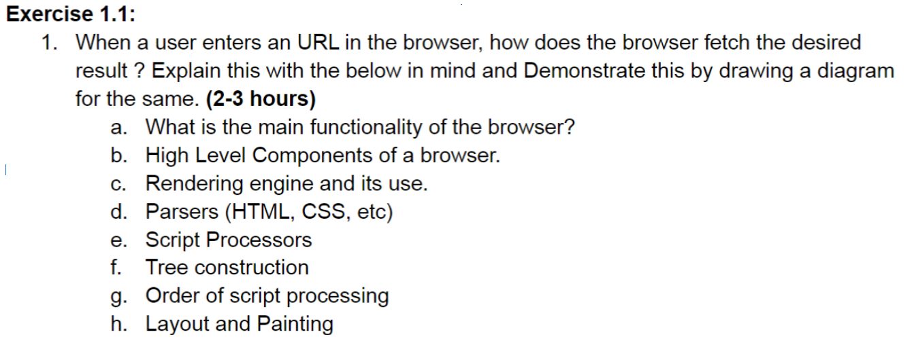
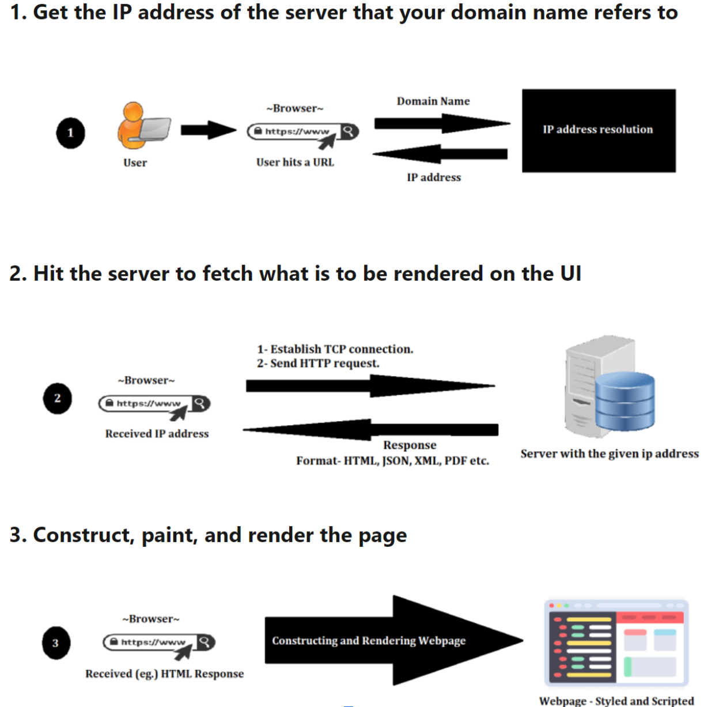
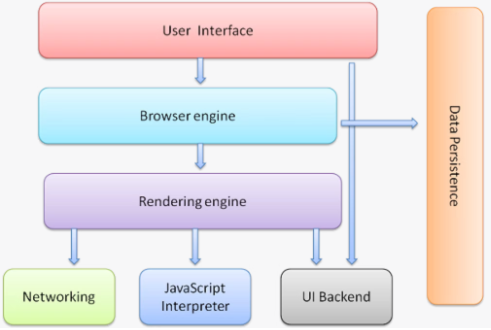
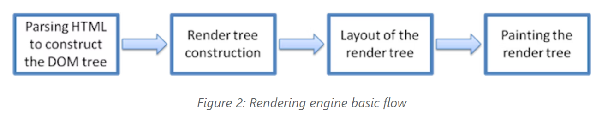
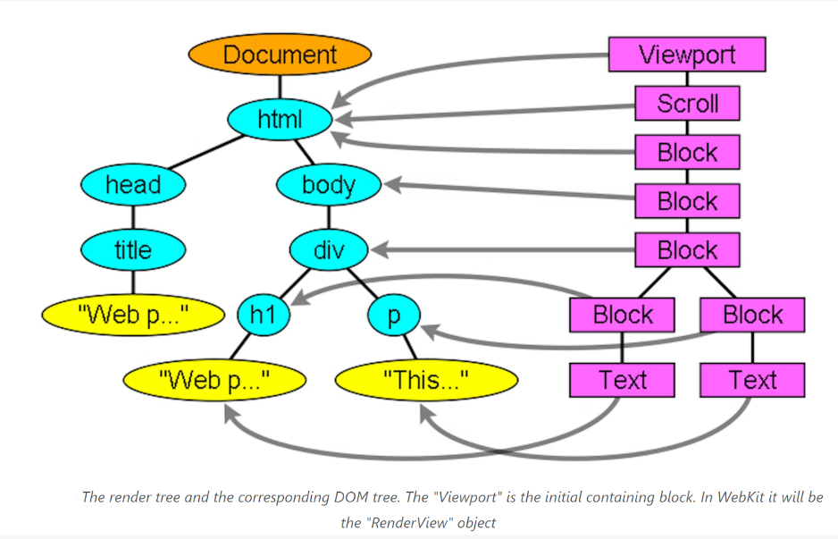
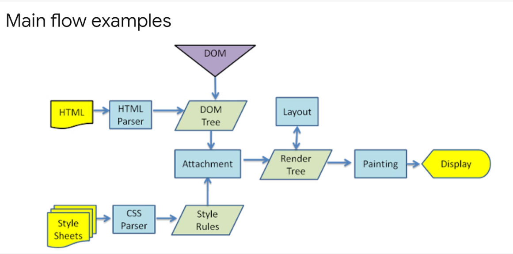

# Problem Statement

## Solution:
### The main functionality of the browser is to request, receive, and render web pages. Folling Image shows how the web content is fetched from the given URL. 

## The high-level components of a browser include:
* **The user interface**: this includes the address bar, back/forward button, bookmarking menu, etc. Every part of the browser displays except the window where you see the requested page.
* **The browser engine**: marshals actions between the UI and the rendering engine.
* **The rendering engine**: responsible for displaying requested content. For example if the requested content is HTML, the rendering engine parses HTML and CSS, and displays the parsed content on the screen.
* **Networking**: for network calls such as HTTP requests, using different implementations for different platforms behind a platform-independent interface.
* **UI backend**: used for drawing basic widgets like combo boxes and windows. This backend exposes a generic interface that is not platform specific. Underneath it uses operating system user interface methods.
* **JavaScript interpreter**. Used to parse and execute JavaScript code.
Data storage. This is a persistence layer. The browser may need to save all sorts of data locally, such as cookies. Browsers also support storage mechanisms such as localStorage, IndexedDB, WebSQL and FileSystem.

## The Rendering Engine:
The rendering engine is responsible for parsing HTML, CSS, and JavaScript code and displaying the content of web pages on the screen. It interprets the HTML code and builds the Document Object Model (DOM) tree, which represents the structure of the web page. It then applies the CSS styles to the DOM tree to determine the layout and appearance of the web page. Finally, it executes any JavaScript code embedded in the web page to add interactivity and dynamic behaviour.

The rendering engine will start parsing the HTML document and convert elements to DOM nodes in a tree called the "content tree". The engine will parse the style data, both in external CSS files and in style elements. Styling information together with visual instructions in the HTML will be used to create another tree: the render tree.

The render tree contains rectangles with visual attributes like colour and dimensions. The rectangles are in the right order to be displayed on the screen.
After the construction of the render tree it goes through a "layout" process. This means giving each node the exact coordinates where it should appear on the screen. The next stage is painting - the render tree will be traversed and each node will be painted using the UI backend layer.
It's important to understand that this is a gradual process. For better user experience, the rendering engine will try to display contents on the screen as soon as possible. It will not wait until all HTML is parsed before starting to build and layout the render tree. Parts of the content will be parsed and displayed, while the process continues with the rest of the content that keeps coming from the network.

# Webkit Browser Engine Main Flow

# Summary

1. The browser parses the URL to extract the protocol (such as HTTP or HTTPS), the domain name, and the resource path.
2. The browser checks its cache to see if it has a copy of the resource. If it does, and the resource has not expired, the browser displays the cached version of the resource.
3. If the resource is not cached or the cached version has expired, the browser initiates a DNS (Domain Name System) lookup to resolve the domain name to an IP address. The DNS server returns the IP address of the server hosting the website.
4. The browser establishes a TCP (Transmission Control Protocol) connection with the server at the specified IP address.
5. Once the TCP connection is established, the browser sends an HTTP request to the server, including the resource path and any additional headers that may be needed.
6. The server processes the HTTP request and sends an HTTP response back to the browser. The response includes the content of the requested resource, as well as additional metadata such as status codes and headers.
7. The browser's rendering engine parses the HTML code and builds the Document Object Model (DOM) tree.
8. The rendering engine applies the CSS styles to the DOM tree to determine the layout and appearance of the web page.
9. The rendering engine executes any JavaScript code embedded in the web page to add interactivity and dynamic behaviour.
10. The browser determines the size and position of each element on the web page and then paints them on the screen.
11. The user can interact with the web page by clicking links, filling out forms, and performing other actions, which trigger additional HTTP requests and responses.
